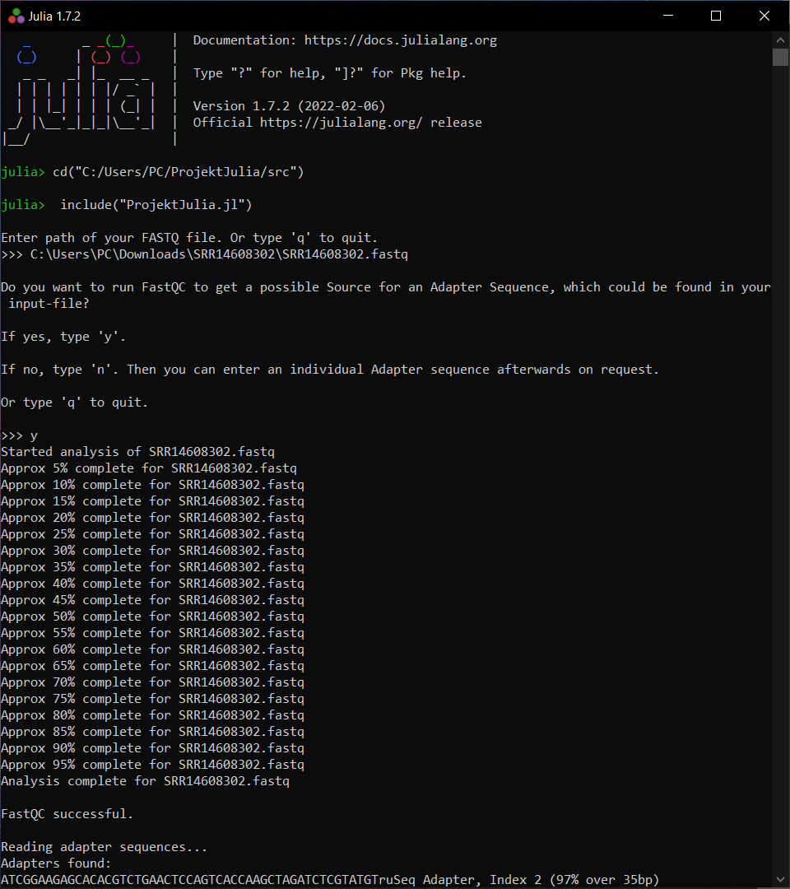

# Sequenzalignierungstool
Autoren: 
Al-Juboori, Faisal;
Kandhari, Neha;
Li, Huije

- [Kurzbeschreibung](#kurzbeschreibung)
- [Benötigte Software](#benötigte-software)
- [Verwendung](#verwendung)

## Kurzbeschreibung
Sequenzalignierungstool (für RNA-Seq-Data) mit Referenzgenom inklusive Read-Aufbereitung (trimmen, Adaptoren / Chimären entfernen, Fehlerkorrektur) und anschließend Ausgabe der Scaffolds.

#### Screenshot

## Benötigte Software

1. Julia 
2. Cutadapt
3. FastQC
4. VSearch
5. Hisat2
6. Samtools

P.S Wir haben kein STAR Alignment verwendet, weil diese Software 30 GB RAM braucht !

Für Linux muss diese über `sudo apt-get <Software>` vorinstalliert werden. 
Für Windows muss dieser Ordner heruntergeladen werden.
_Hinweis_: Da Windows kein Hisat2 und Samtools verwenden kann, wird auch keine Alignment stattfinden. Die Ausführung mit Windows endet mit der Readaufbereitung.

## Verwendung
1. Öffne Julia.
2. Wechsele ins Working Directory, wo sich auch die ProjektJulia.jl befindet.  
` cd("Path to .jl File") `
3. Führe nun die .jl-Datei mit aus `include("ProjektJulia.jl")`
4. Befolge nun die Anweisungen.
